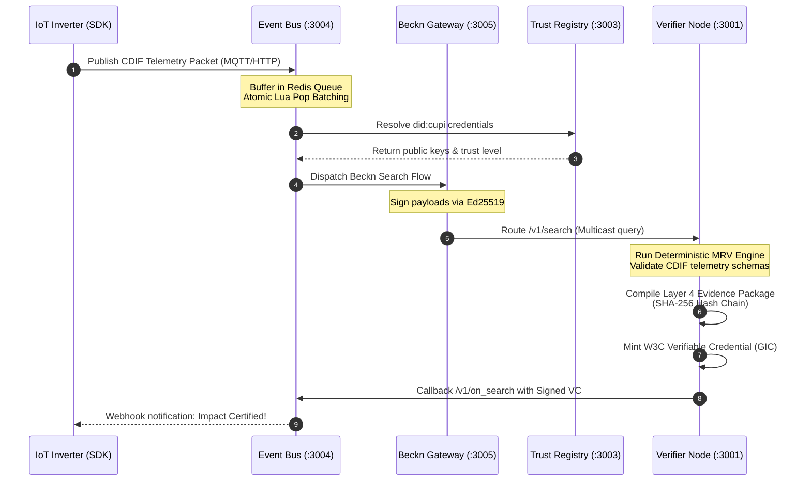

# 🌍 Carbon DPI (Decentralized Protocol for Climate Action)

<p align="center">
  
</p>

<p align="center">
  <strong>The Open-Source Digital Public Infrastructure (DPI) for Real-Time, Verifiable Climate Action</strong>
</p>

<p align="center">
  <a href="#-the-vision">Vision</a> •
  <a href="#%EF%B8%8F-core-use-cases">Use Cases</a> •
  <a href="#-repository-architecture">Architecture</a> •
  <a href="#%EF%B8%8F-telemetry-to-certificate-pipeline">Data Flow</a> •
  <a href="#%EF%B8%8F-quick-start--setup">Setup & Run</a> •
  <a href="#-verifying-certificates">Verification Guide</a>
</p>

<p align="center">
  
  
  
  
  
</p>

---

## 🎯 The Vision

Carbon DPI is to climate action verification what **UPI** is to digital payments and **Beckn** is to open commerce—a decentralized, open-source standard for digital Measurement, Reporting, and Verification (dMRV). 

Traditional carbon markets suffer from opaque audits, slow manual verification, and high transaction costs that shut out small-scale climate assets. Carbon DPI changes the paradigm by establishing a standard protocol that connects physical IoT sensors directly to W3C Verifiable Credentials (VCs). By programmatically calculating offsets and ensuring mathematical transparency from telemetry to certificate, Carbon DPI democratizes trust in global green impact.

---

## ⚡️ Core Use Cases

Carbon DPI provides a unified schema framework for multi-sector climate action:

1. **Decentralized Solar PV Offsets (`CUPI-METH-001`)**
   * Programmatic calculation of avoided grid emissions ($tCO_2e$) by linking solar inverter generation telemetry directly to verification nodes.
2. **EV Fleet Emissions Reduction (`CUPI-METH-004`)**
   * Dynamic calculation of tailpipe emissions offset based on electric vehicle mileage telemetry compared to baseline internal combustion engine (ICE) tailpipes.
3. **MSME Decarbonization & CBAM Tracking (`CUPI-METH-002`)**
   * Real-time monitoring of energy consumption profiles for MSMEs to dynamically issue verified carbon footprints, facilitating EU CBAM (Carbon Border Adjustment Mechanism) compliance.
4. **Soil Carbon & Regenerative Agriculture (`CUPI-METH-003`)**
   * Integration of soil telemetry probes and remote sensing data to verify carbon sequestration rates in agricultural soils.

---

## 📦 Repository Architecture

This monorepo uses **Turbo** and **npm Workspaces** to structure the entire Carbon DPI ecosystem. Below is the detailed breakdown of the components:

```
├── carbon-dpi-api/               # OpenAPI 3.0 specs and routes
├── carbon-dpi-beckn-adapter/     # Cryptographic helpers, signing & payload builders
├── carbon-dpi-beckn-gateway/     # Beckn-compliant Routing & Multicast gateway
├── carbon-dpi-event-bus/         # MQTT/HTTP High-speed Ingestion & Redis buffering
├── carbon-dpi-methodologies/     # JSON-encoded MRV offset methodologies & emission factors
├── carbon-dpi-reference-node/    # Layer 3-5 Verification Node, MRV Engine, & VC Issuer
├── carbon-dpi-registry/          # Layer 2 Trust Registry (verifier/device directory)
├── carbon-dpi-sdk-js/            # Client-side JavaScript/TypeScript IoT SDK
├── carbon-dpi-sdk-python/        # Client-side Python IoT SDK
├── carbon-dpi-spec/              # Official protocol specifications and schemas (CDIF/GIC)
├── carbon-dpi-reference-solar/   # Solar PV reference simulator
├── carbon-dpi-reference-ev/      # EV fleet reference simulator
└── carbon-dpi-reference-msme/    # MSME energy monitor simulator
```

### Component Details

* **`carbon-dpi-api`**: Houses the global OpenAPI yaml definitions defining endpoints across the protocol layers, ensuring standardized service contracts.
* **`carbon-dpi-beckn-adapter`**: Provides core shared cryptography. Implements Ed25519 key generation, cryptographic signing of Beckn request headers (`Authorization` header checks), and common schema validators.
* **`carbon-dpi-beckn-gateway`**: Acts as a stateless routing gateway. Intercepts Beckn payloads, runs subscriber lookup in the Trust Registry, verifies proxy signatures, and forwards queries to active Verifier Nodes.
* **`carbon-dpi-event-bus`**: Built for scale. Exposes a high-throughput HTTP `/v1/ingest` and an embedded MQTT broker (port `1883`). Buffers telemetry points into a Redis-backed queue and uses atomic Lua scripts to pop batches safely for verification.
* **`carbon-dpi-methodologies`**: The registry of approved MRV formulas and official emission factors (e.g., Central Electricity Authority of India Grid Baseline factors, IPCC values). Programmed in machine-readable JSON.
* **`carbon-dpi-reference-node`**: The core brain. Performs **dMRV** calculations, evaluates device trust scores, assembles **Layer 4 Evidence Packages** (SHA-256 hash chains of telemetry data), mints W3C Verifiable Credentials (GICs), manages dynamic revocations, and dispatches webhooks via a transactional outbox queue.
* **`carbon-dpi-registry`**: The Layer 2 identity directory. Stores verified device DIDs (`did:cupi`), verifier keys, subscriber registry, and resolves DID metadata dynamically.
* **`carbon-dpi-sdk-js` / `carbon-dpi-sdk-python`**: Lightweight client libraries that run inside edge inverters, EV telematics, or smart meters to format telemetry in the Carbon Data Ingestion Format (CDIF) and calculate the Composite Identity Hash (CIH).

---

## ⛓️ Telemetry-to-Certificate Pipeline

Carbon DPI separates data verification into a clean, 5-layer stack. The data flow moves dynamically from physical edge sensors to public cryptographic credentials:



---

## ⚡ Quick Start (5 Minutes to Your First GIC)

The absolute fastest way to see Carbon DPI in action.

1. **Clone the repo**:
   ```bash
   git clone https://github.com/carbon-dpi/carbon-dpi.git
   cd carbon-dpi
   ```

2. **Install dependencies**:
   ```bash
   npm install
   ```

3. **Run the 5-Minute Setup script**:
   ```bash
   npm run setup
   ```

   **What this does**:
   - Generates Ed25519 keys (Base64 DER) and creates your `.env`
   - Runs `prisma db push` to initialize local SQLite databases
   - Starts all 4 core services (Registry, Gateway, Event Bus, Node)
   - Registers a test Solar Inverter device with the Trust Registry
   - Streams a batch of telemetry through the Event Bus
   - Issues your first cryptographically verifiable Green Impact Certificate!

---

## 🛠️ Manual Setup & Configuration

The Carbon DPI monorepo supports both direct local execution (using SQLite) and production-grade deployments (using Docker & PostgreSQL).

### Prerequisites
* **Node.js**: `v18+` (LTS recommended)
* **Redis**: Required for local event-bus queuing
* **Docker & Docker Compose** (optional, for production Postgres setup)

---

### Generating Keys

Before running manually or via Docker, you must generate Ed25519 keys for your Reference Node to sign W3C VCs.

```bash
npm run keygen
```
*Copy the generated `BECKN_ED25519_PRIVATE_KEY` and `BECKN_ED25519_PUBLIC_KEY` into your `.env` file. These are Base64-encoded DER (PKCS8/SPKI) formats.*

---

### Method A: Local Development Setup (SQLite)
Perfect for testing and lightweight local debugging without full Postgres overhead.

1. **Install Dependencies**:
   ```bash
   npm install
   ```

2. **Launch Dev Server (Turbo Live-Reload)**:
   Ensure a local Redis server is running (`redis-server`), then run:
   ```bash
   npm run dev
   ```
   *(Note: `npm run dev` automatically runs database migrations via `predev`)*

---

### Method B: Production-Grade Deployment (Docker Compose)
This spins up PostgreSQL databases (automatically seeded), Redis queue, the Trust Registry, Beckn Gateway, Event Bus with MQTT, and a reference Verifier Node.

1. **Configure Environment Variables**:
   Create a root `.env` file:
   ```bash
   BECKN_ED25519_PRIVATE_KEY=your_generated_base64_der_private_key
   BECKN_ED25519_PUBLIC_KEY=your_generated_base64_der_public_key
   ```

2. **Launch Ecosystem**:
   ```bash
   docker-compose up --build
   ```

3. **Verify running containers**:
   * **Trust Registry**: `http://localhost:3003`
   * **Verifier Node**: `http://localhost:3001` (mapped to `3099` for testing)
   * **Beckn Gateway**: `http://localhost:3005`
   * **Event Ingest/MQTT Broker**: `http://localhost:3004` & `mqtt://localhost:1883`

---

## 🔬 Verifying Certificates

Carbon DPI ensures that issued Green Impact Certificates (GICs) are fully self-verifying, requiring no private databases to prove their authenticity.

### 1. W3C Verifiable Credential Structure
A GIC is formatted as a W3C Verifiable Credential:
```json
{
  "@context": [
    "https://www.w3.org/2018/credentials/v1",
    "https://schema.carbon-dpi.org/contexts/gic/v1"
  ],
  "id": "urn:uuid:GP-GIC-2026-F98D65AA",
  "type": ["VerifiableCredential", "GreenImpactCertificate"],
  "issuer": "did:cupi:india:verifier:GREENPE-VERIFY-001",
  "issuanceDate": "2026-06-22T08:46:00Z",
  "credentialSubject": {
    "id": "did:cupi:india:solar:GP-IND-2026-GJ-044821-SOL",
    "activity": {
      "type": "GridConnectedSolarGeneration",
      "methodology": "CUPI-METH-001",
      "impact": {
        "value": 0.134,
        "unit": "tCO2e",
        "description": "Carbon emissions avoided via solar generation"
      }
    },
    "evidenceHash": "e0df3fa1cafcb8e0df3fa1cafcb8e0df3fa1cafcb8e0df3fa1"
  },
  "proof": {
    "type": "Ed25519Signature2020",
    "created": "2026-06-22T08:46:01Z",
    "verificationMethod": "did:cupi:india:verifier:GREENPE-VERIFY-001#key-1",
    "proofPurpose": "assertionMethod",
    "proofValue": "z24fGhK...Ed25519Signature..."
  }
}
```

### 2. The Verification Checklist
To verify a GIC downstream:
1. **Schema Check**: Ensure compliance with the `gic-w3c-vc.schema.json` specification.
2. **Signature Verification**: Extract the public key from the `issuer` metadata inside the Trust Registry and cryptographically verify the signature (`proofValue`) against the canonicalized credential subject body.
3. **Evidence Package Audit**: Re-hash the telemetry data linked in `evidenceHash` to ensure the raw sensor measurements have not been tampered with or modified.
4. **Revocation Check**: Query the W3C Status List endpoint of the issuer. A binary status bitstring checks if the index of this GIC is set to `1` (Revoked) or `0` (Active).

---

## 📈 Observability & Operations

All active protocol nodes expose standardized operational endpoints for enterprise observability:
* **API Documentation**: Open `/v1/docs` on any service to view interactive Swagger OpenAPI specs.
* **Health Checks**: Ping `/v1/heartbeat` or `/v1/status` to fetch operational metrics and service database states.
* **Telemetry Tracing**: Out-of-the-box OpenTelemetry instrumentation enables deep performance traces across the ingestion pipeline.

---

## 🤝 Contributing

We believe that open-source code is the single greatest tool humanity has to fight the climate crisis. If you would like to submit new MRV methodologies (`carbon-dpi-methodologies`), propose changes to the telemetry schema (`carbon-dpi-spec`), or optimize the event bus pipeline, please read our [Contributing Guidelines](carbon-dpi-spec/CONTRIBUTING.md) and submit a pull request!

---

<p align="center">
  <strong>Carbon DPI</strong> — Restoring Mathematical Integrity to the Global Green Transition<br/>
  <a href="https://greeenpe.com">greeenpe.com</a> • Maintained by GreenPe Technologies
</p>